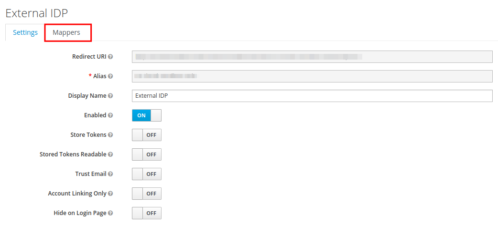
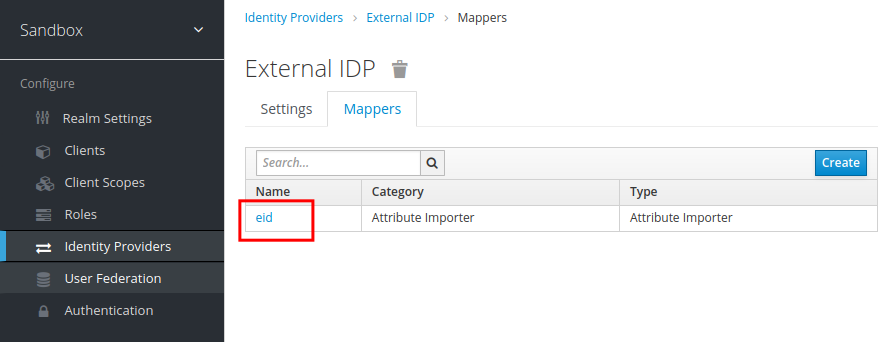
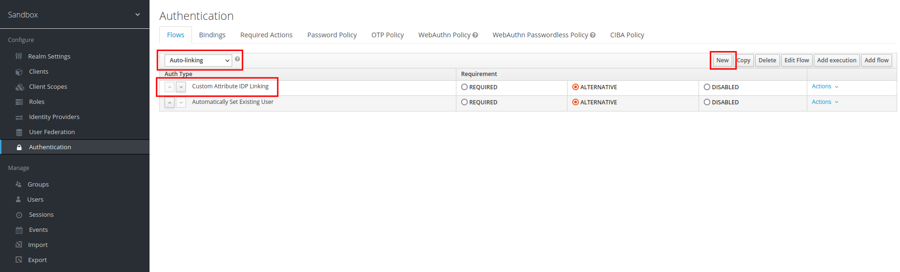
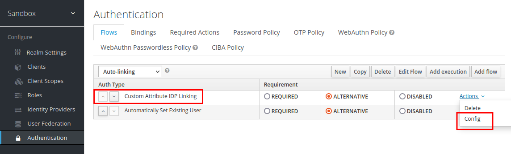
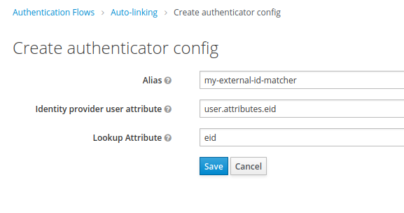
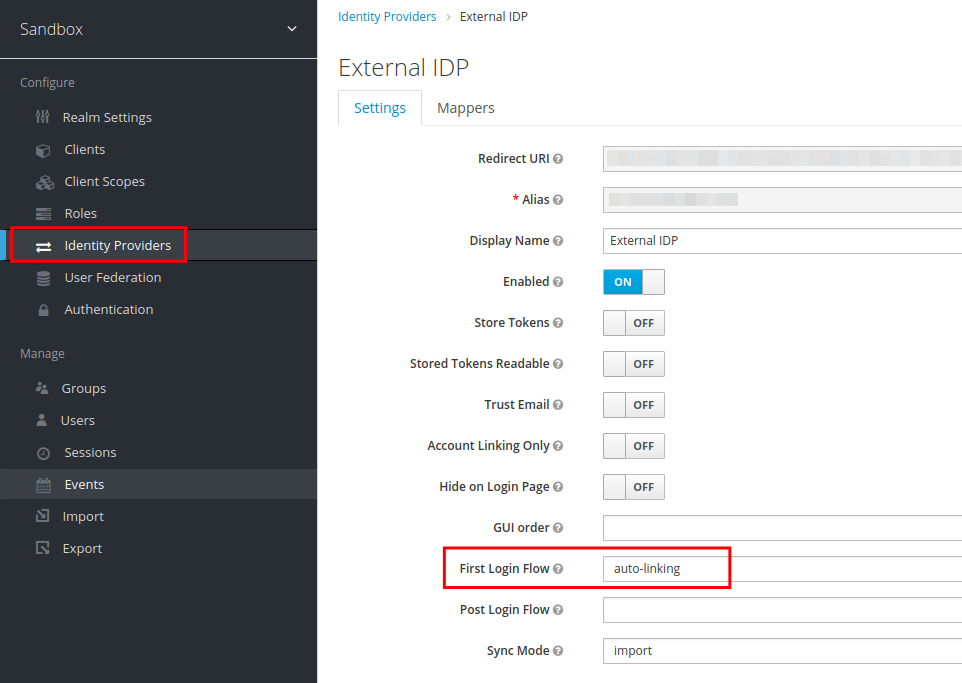
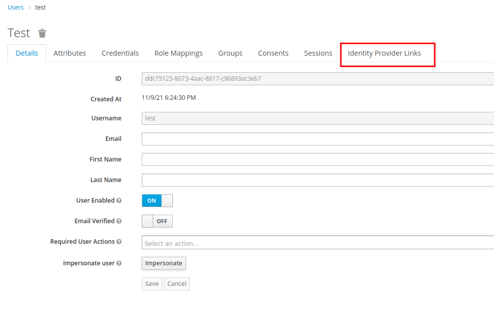

# Keycloak Custom Attribute IDP Linking

Keycloak default authenticator flows for external identity provider brokering only match  existing users only on username and 
password attributes. If you want to lookup user with different attributes you can use this extension. If you for example 
get attribute `eid` from your external provider and want your local user, for example from ldap storage provider matched where 
you store this `eid` value in an attribute with name `u_eid` you can do so. Matching attributes will add identity provider 
links in keycloak and your users will not get created twice in your keycloak database. An example would be European Union 
[eIDAS](https://digital-strategy.ec.europa.eu/en/policies/discover-eidas) project with services/members like 
[ID Austria](https://www.oesterreich.gv.at/id-austria.html).

## Installation

Tested on Keycloak 15.0.2.

### Install Plugin/Extension

Copy or mount plugin in your keycloak installation depending on your environment (k8s, compose, gke). 
For example in `/opt/jboss/keycloak/standalone/deployments/` (see file docker-compose.yml). You should see something like 
following in your keycloak log:

```
...
WFLYSRV0010: Deployed "keycloak-custom-attribute-idp-linking-1.0.0.jar" (runtime-name : "keycloak-custom-attribute-idp-linking-1.0.0.jar")
...
```

Now you can use __Custom Attribute IDP Linking__ Authenticator in your Keycloak Authentication configuration.


Setup below is only for testing and your production configuration might differ. Read more about Keycloak Authenticators and 
Flows Configuration in this [Documentation](https://www.keycloak.org/docs/latest/server_admin/).

### [Optional] Check your external provider attribute mapping

If necessary check whether you really map and import the attribute you want to use for matching users.





### Create Custom Authentication Flow

Go to Authentication and create a new Flow. In this example will call it __Auto-linking__. Next add this extensions 
__Custom Attribute IDP Linking__ execution as well as the standard __Automatically Set Existing User__ as a fallback.



Adjust configuration to your needs. Attribute name on external side and lookup attribute for existing users.





### Set first login flow

Set first login flow in your identity provider configuration to your newly created custom flow.



### [Optional ;)] Check config

Login in using your external provider and check if user get linked to the provider.





## Development

```shell
mvn clean install
```

```shell
docker-compose up
```

Update Plugin in container by running ```mvn install```.

Attach remote jvm debug session on port 5005 (default).
